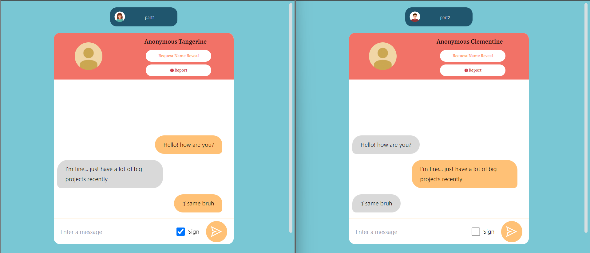
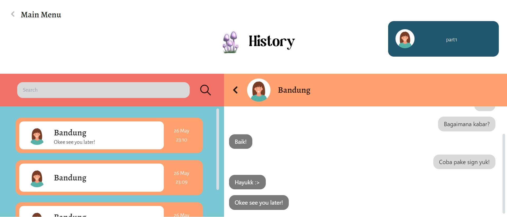

# 🗯️🗨️ End-to-end Encryption Messaging App
> Frontend side of End-to-end encryption messaging app created with React Typescript and NodeTS

## General Information
This app is a secure messaging application that provides application layer security, end-to-end encryption, and digital signatures. It is available for web and mobile-website.

**Application layer security** is implemented using Elliptic-curve Diffie–Hellman (ECDH) and Block Cipher to protect the communication between the client and the server.

**End-to-end encryption** is implemented using Elliptic Curve Cryptography (ECC) to ensure that only the sender and intended recipient can read the messages.

**Digital signatures** are used to verify the authenticity and integrity of messages. They are generated using the Schnorr signature scheme and are based on the content of the message and the signer's private key. Digital signatures can be viewed by the recipient but are not stored with the message. The recipient can also verify that the signature is valid, which proves that the message has not been tampered with and that it came from the claimed sender.

## 🗄️ &nbsp;Backend
Algorithm, database, key storage, and sockets for any messaging logic stated on [this repository](https://github.com/mikeleo03/E2EE-Secure-Messaging-App-BE)

## ⚙️ &nbsp;How to Compile and Run the Program
Clone this repository from terminal with this command
``` bash
$ git clone https://github.com/mikeleo03/E2EE-Secure-Messaging-App-FE.git
```
### Run the application on development server
Compile and download some required modules by running the following *command*
``` bash
$ npm install
$ npm run dev
```
If you do it correctly, the pogram should be running on localhost:3000. Don't forget to run the backend side also. Further explanation on how to run the backend development server stated on [this repository](https://github.com/mikeleo03/E2EE-Secure-Messaging-App-BE)

## Available Scripts
In the project directory, you can run:

### `npm run dev`

Ths runs the app in the development mode.

### `npm run dev:5000`

Ths runs the app in the development mode if you need another chat channels, from port 5000.

The page will reload if you make edits.<br />
You will also see any lint errors in the console. You can also use the environment by appyling the basic .env configuration on .env.example file.

## 📸 &nbsp;Screenshots



## 👨‍👨‍👦‍👦  Authors
| Name                     |   Student ID   |  
| ------------------------ | -------- |
| [Austin Gabriel Pardosi](https://github.com/AustinPardosi)          | 13521084 |
| [Michael Leon Putra Widhi](https://github.com/mikeleo03) | 13521108 |
| [Farhan Nabil Suryono](https://www.github.com/Altair1618) | 13521114 |